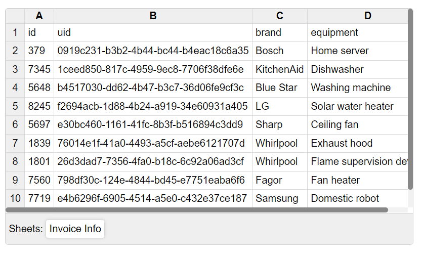
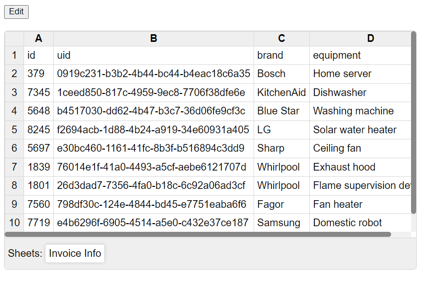
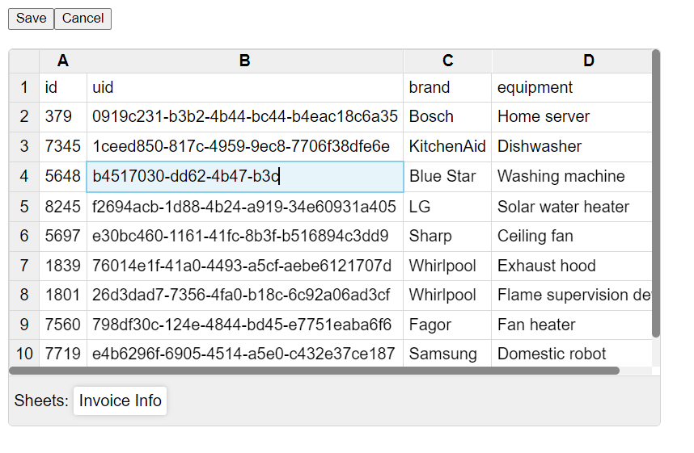
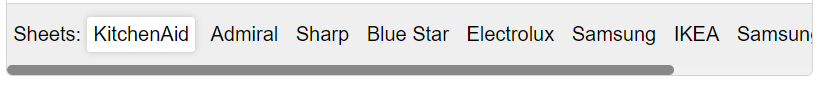

# Ngx Excel Viewer


Ngx-excel-viewer is an angular library to view/edit excel data in the angular application where data is in the form of matrix of string.

Angular version >= 15.2.0

## Usage
```typescript
<ngx-excel-viewer 
    *ngIf="isFetched" 
    [data]="data" 
    [editable]="isEditable" 
    id="source" 
    saveDataOutput="edited-only"
    (onDataSave)="onSave($event)" 
    [sheetNames]="['Invoice Info']"
    [events]="eventEmitter"
    (onScrollEnd)="onScroll($event)">
</ngx-excel-viewer>
```

```typescript
let data = [
  ["Year", "Car Name", "Car Type", "Horse power", "Engine"],
  ["2017", "Telsa", 11, 12, 13],
  ["2018", "Audi", 11, 14, 13],
  ["2019", "BMW", 15, 12, 13]
];
```

## Example

[See example](../../src/app/)

## Screenshots


Excel Viewer


Edit Button (Put button in parent component)


Editing View


Multiple Sheet Names View

## Properties

| Property | Value Type  | Description |
| -------- | --------    | --------    |
| id       | string      | id to identify multiple viewers      |
| data     | {'sheetName': string[ ][ ]} | Excel data in the form of multi-dimensional array   |
| editable | boolean     | Enables/disables edit functionality      |
| sheetNames | string[ ]    | Sheet names in the excel data   |
| events | Behavior Subject <{id: string, type: string}> | Triggers events   |
| onDataSave | void function({ id: string, pageNo: number, sheet: string }) | Returns data to save |
| onScrollEnd | void function({ id: string, pageNo: number, sheet: string }) | Triggered when scrolled to end of viewer (vertically) |
| saveDataOutput | "complete" / "edited-only" | "complete" returns whole data with modified data included, whereas "edited-only" returns from modified rows |